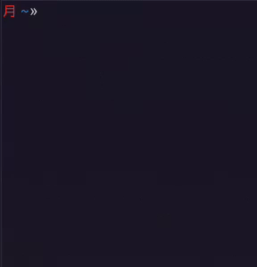
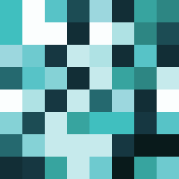
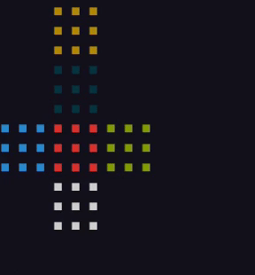

<h1 align="center">Hi there 👋</h1>
<h2 align="center">I'm Kosta</h2>

I'm a student at <a style="text-decoration:underline" href="https://www.finki.ukim.mk">FCSE</a>, tech and science enthusiast, currently working on small personal projects and job searching.

<h3 align="center">Langs</h3>
<h4 align="center">Fairly proficient in</h4>

  

<h4 align="center">Some knowledge in / Need to learn more about</h4>

  

<h3 align="center">Tech I use</h3>

  

<h3 align="center">Interested in starting / learning more about</h3>

  
  
  
  

<h3 align="center">

</h3>

<h3 align="center">Get in touch!</h3>

<table align="center" style="text-align:center;margin-left:auto;margin-right:auto;">
  <tr>
    <th>:mailbox_with_no_mail: Email</th>
  </tr>
  <tr>
    <td><a href="mailto:kostamecev@pm.me">kostamecev@pm.me</a></td>
  </tr>
</table>

<table align="center" style="text-align:center;margin-left:auto;margin-right:auto;">
  <tr>
    <th>  LinkedIn</th>
  </tr>
  <tr>
    <td><a href="https://www.linkedin.com/in/kostamecev/">Konstantin Mechevski</a></td>
  </tr>
</table>

<table align="center" style="text-align:center;margin-left:auto;margin-right:auto;">
  <tr>
    <th>:lock: PGP Pubkey</th>
  </tr>
  <tr>
    <td align="center"><a href="public.pgp">FE 11 E9 6D</a></td>
  </tr>
</table>

<h2 align="center">Check out my projects!</h2>

colcipher            |   sha256vis   | rubiks-cube
:--------------:|:-----------:|:-------------------------:
)  |   |

<!--
- 🔭 I’m currently working on ...
- 🌱 I’m currently learning ...
- 👯 I’m looking to collaborate on ...
- 🤔 I’m looking for help with ...
- 💬 Ask me about ...
- 📫 How to reach me: ...
- 😄 Pronouns: ...
- ⚡ Fun fact: ...
--->

